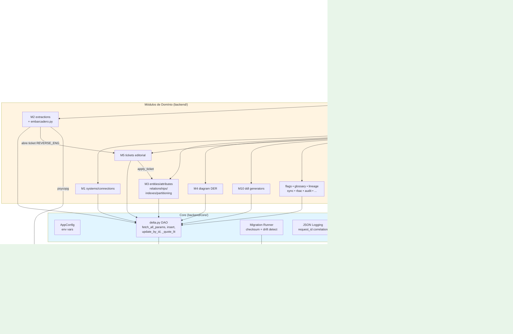
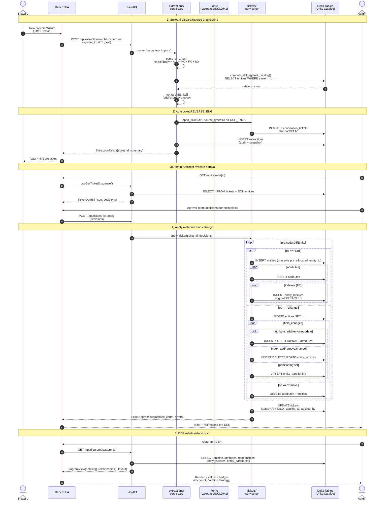

# Handover Técnico — Núclea Modeler

> **Versão analisada**: `0.2.1` (commit `752b9be` em `main`)
> **Audiência**: equipe que vai manter, evoluir e operar o app no workspace do cliente
> **Idioma**: PT-BR (consistente com o projeto)

---

## 1. Visão Geral (Macro) e Objetivo do Projeto

O **Núclea Modeler** é um **catálogo + ferramenta de modelagem de dados corporativos**, entregue como um **Databricks App nativo** (full-stack FastAPI + React). Resolve o problema clássico de empresas com vários ambientes (HINT/HEXT/PROD), múltiplos SGBDs (Oracle, SQL Server, PostgreSQL, Databricks/Delta) e modelos lógicos em ferramentas externas (Embarcadero ER/Studio): ele consolida tudo num único lugar, **versionado no Unity Catalog**, com governança via tickets de aprovação.

O **fluxo de valor principal** é o ciclo de **engenharia reversa → modelagem → DDL**:

1. Um steward conecta o app a uma fonte (Lakebase Postgres, Unity Catalog, arquivo `.DM1` do ER/Studio, ou SQL bruto) ou cria do zero.
2. O app **extrai** entities, atributos, PKs, FKs, índices e particionamento, abre um **ticket de reconciliação** com o diff vs catálogo atual.
3. O architect/admin revisa, aprova → o app **materializa** as mudanças nas tabelas Delta do próprio Unity Catalog (sem tocar a fonte).
4. Modeladores editam o DER (drag-and-drop), atributos, relationships, índices — toda mutação vai pra um **ticket OPEN editorial** (janela de 15 min) que é aplicado em lote ao final.
5. Architects geram **DDL multi-dialeto** (Postgres/Oracle/T-SQL/MySQL/Spark/ANSI) ou publicam versões snapshot pra release.

Não há banco operacional externo — todo estado vive em **18+ tabelas Delta** dentro de `${CATALOG}.${SCHEMA}` parametrizáveis. Isso torna o app **workspace-agnostic** (mesmo binário roda em qualquer Databricks com Unity Catalog) e o backup vira `DEEP CLONE` ou Delta TimeTravel.

---

## 2. Stack Tecnológica e Frameworks

| Camada | Tecnologia | Versão | Papel / Responsabilidade |
|---|---|---|---|
| **Runtime** | Databricks Apps | n/a (gerenciado) | Plataforma onde o app sobe; força SSO em todo endpoint |
| **Backend lang** | Python | `>= 3.11` | Linguagem do servidor |
| **API** | FastAPI | `>= 0.119` | HTTP framework, OpenAPI auto-gerado, DI |
| **Server** | Uvicorn | `>= 0.37` | ASGI runner (2 workers em prod) |
| **Validation** | Pydantic | `>= 2` | Models In/Out, settings, validação de payload |
| **Settings** | pydantic-settings | `>= 2.11` | Env vars → `AppConfig` |
| **DB cliente Databricks** | databricks-sdk | `>= 0.74` | Workspace ops (UC, apps, secrets) |
| **DB SQL Delta** | databricks-sql-connector | `>= 3.5` | Conexão ao Warehouse pra rodar SQL nas Delta tables |
| **DB Postgres (Lakebase)** | psycopg | `>= 3.3` (binary) | Extraction direta de Lakebase via OAuth M2M |
| **SQL parser** | sqlglot | `>= 25` | Parser cross-dialect pra importar arquivos `.sql` |
| **HTTP client** | httpx | `>= 0.28` | REST connection testers (Module 1) |
| **ODBC** | pyodbc | `>= 5.3` | ODBC connection testers (opcional, requer unixodbc) |
| **Frontend lang** | TypeScript | `5.9` | Linguagem cliente |
| **UI framework** | React | `19.2` | UI |
| **Build** | Vite | `7.3` (via Bun) | Bundler, dev server, preview |
| **Router** | @tanstack/react-router | `1.170` | File-based routing em `ui/routes/` |
| **Data fetching** | @tanstack/react-query | `5.100` | Suspense queries + mutations |
| **HTTP client UI** | axios | `1.16` | Camada base da `ui/lib/api.ts` (orval-style gerado) |
| **DER canvas** | @xyflow/react | `12.10` | Flowchart pro Diagrama Entidade-Relacionamento |
| **DER layout** | @dagrejs/dagre | `1.1` | Layout automático do DER |
| **Editor SQL** | Monaco Editor | `0.55` | Visualizador/editor de DDL |
| **Component library** | shadcn/ui + Radix | n/a (vendored) | Buttons, Dialog, Tooltip, etc. |
| **Style** | Tailwind CSS | `4.3` | Utility-first CSS |
| **Toast** | sonner | `2.0` | Notificações |
| **Tests Python** | pytest + pytest-cov | `>= 8` | Cobertura ≥ 65% gate (`tool.pytest.ini_options`) |
| **Tests E2E** | Playwright | (config próprio) | Smoke + features críticas |
| **Linter Python** | ruff | `>= 0.6` | Lint + format |
| **Security scan** | bandit | `>= 1.7.10` | Hard-gate em CI |

### Justificativa arquitetural

- **Databricks-native by design**: o app é distribuído como `databricks apps deploy`. Auth = SSO Databricks. Estado = Delta tables no Unity Catalog. Sem Postgres operacional, Redis ou S3 fora do workspace. Decisão deliberada — reduz custo de operação para a Núclea (sem nova infra).
- **FastAPI + Pydantic 2**: APIs tipadas com OpenAPI auto-gerado; cliente TS regerado a partir do schema (via Orval-style). Reduz drift entre back e front.
- **TanStack Router + Suspense queries**: routing file-based + reads sempre via `useXSuspense + selector()` e mutations via `useMutation`, com `Suspense + ErrorBoundary` em volta — pattern uniforme em toda UI.
- **Delta para tudo**: TimeTravel cobre auditoria por padrão; Change Data Feed (`delta.enableChangeDataFeed = true`) habilitado nas tabelas mutáveis facilita observabilidade.
- **Modelo editorial via ticket**: nenhuma mutation grava direto no catálogo. Vai pra ticket OPEN MANUAL (15 min de janela), depois apply em lote. Decisão crítica — viabiliza governança e undo de sessão inteira.

---

## 3. Estrutura de Pastas e Arquitetura do Código

```text
nuclea_modeler/
├── app.yml                          # Config Databricks Apps (NÃO commitar com credenciais)
├── app.yml.example                  # Template do cliente
├── pyproject.toml                   # Deps Python + ruff/pytest config
├── package.json                     # Deps frontend (Bun + Vite + React 19)
├── requirements.txt                 # Espelho do pyproject (deploy direto)
├── README.md                        # Pitch + tutorial inicial
├── DEPLOY.md                        # Guia passo-a-passo de deploy
├── SECURITY.md                      # Modelo de ameaças + histórico CVE
├── CHANGELOG.md                     # Keep-a-Changelog
├── HANDOVER.md                      # ◀ este arquivo
│
├── databricks/
│   ├── sql/                         # Migrations versionadas (idempotentes)
│   │   ├── 001_create_schema.sql    #   USE CATALOG/SCHEMA + bootstrap
│   │   ├── 002_create_tables.sql    #   18 Delta tables core
│   │   ├── 003-009_*.sql            #   seeds + flags + tickets + lakebase
│   │   ├── 010_shared_entities.sql
│   │   ├── 011_system_environment.sql
│   │   └── 012_indexes_and_partitioning.sql  # ◀ último (índices/partição)
│   └── dashboards/                  # Lakeview + Genie space JSONs
│
├── docs/
│   ├── tutorial/                    # Getting started 20-min
│   ├── architecture/                # ADRs + diagramas internos
│   ├── deploy/                      # Guia HTML pro cliente
│   ├── operations/                  # Runbook prod (livez/readyz, métricas)
│   ├── spec/                        # Specs funcionais por módulo
│   ├── adr/                         # Architecture Decision Records
│   └── openapi.json                 # Snapshot — drift check no CI
│
├── scripts/
│   ├── run_migrations.py            # Pré-uvicorn, single-shot
│   └── dump_openapi.py              # Regera o snapshot
│
├── src/nuclea_modeler/
│   ├── _metadata.py                 # api_prefix = "/api", app_version
│   │
│   ├── backend/                     # ◀ FastAPI app (Python)
│   │   ├── app.py                   # Monta todos os routers + middlewares
│   │   ├── router.py                # Endpoints raiz (/livez, /readyz, /version)
│   │   │
│   │   ├── core/                    # ★ Infraestrutura compartilhada
│   │   │   ├── _factory.py          #   create_app() — lifespan, migrations, CORS
│   │   │   ├── _config.py           #   AppConfig (env → settings)
│   │   │   ├── _nuclea_config.py    #   get_settings() helper + fq_table()
│   │   │   ├── delta.py             #   DAO Delta (fetch_*, insert, update_by_id, _quote_lit)
│   │   │   ├── sql.py               #   Sql dependency (Statement Execution API)
│   │   │   ├── migrations.py        #   Runner com checksum + drift detect
│   │   │   ├── security.py          #   RateLimit + SecurityHeaders middlewares
│   │   │   ├── logging.py           #   JSON logs + RequestIdMiddleware
│   │   │   ├── metrics.py           #   /metrics endpoint + MetricsMiddleware
│   │   │   ├── exceptions.py        #   install_exception_handlers
│   │   │   └── features.py          #   Feature flags
│   │   │
│   │   ├── systems/                 # M1 — sistemas catalogados
│   │   ├── connections/             # M1 — conexões ODBC/REST/DDL
│   │   ├── extractions/             # M2 — engenharia reversa (Lakebase/UC/DM1/DDL)
│   │   │   ├── embarcadero.py       #   parser .DM1 (CSV multi-seção)
│   │   │   ├── service.py           #   extract_from_lakebase / extract_from_uc
│   │   │   └── router.py
│   │   ├── entities/                # M3 — entities + attributes + indexes + partition
│   │   │   ├── indexes.py           #   stage + apply helpers (índices/partição)
│   │   │   ├── index_overlay.py     #   editorial overlay (puro, testável)
│   │   │   ├── index_validation.py  #   regras de validação (PK_DUP, SUBSET, etc.)
│   │   │   └── router.py            #   /entities + /attributes + /indexes + /partitioning
│   │   ├── relationships/           # M3 — relationships PK→FK
│   │   ├── diagram/                 # M4 — DER (DiagramEntity/Relationship/IndexSummary)
│   │   ├── tickets/                 # M5 — reconciliation tickets + apply_ticket
│   │   │   ├── service.py           #   apply_ticket (>700 linhas, 1 grande máquina de estados)
│   │   │   └── session.py           #   editorial session helpers (15 min)
│   │   ├── flags/                   # M6 — entity_flags / attribute_flags (LGPD, etc.)
│   │   ├── glossary/                # M7 — glossary_terms + mappings
│   │   ├── lineage/                 # M8 — upstream/downstream
│   │   ├── sync/                    # M9 — espelha catálogo → UC
│   │   ├── ddl/                     # M10 — generators multi-dialeto
│   │   │   └── generators.py        #   gen_postgres/tsql/plsql/mysql/sparksql/ansi
│   │   ├── versions/                # versionamento de modelo (DRAFT/PUBLISHED/ACTIVE)
│   │   ├── lakebase/                # Postgres connection helper (OAuth M2M)
│   │   ├── uc/                      # UC SDK wrappers
│   │   ├── rbac/                    # 4 papéis (VIEWER/STEWARD/ARCHITECT/ADMIN)
│   │   ├── audit/                   # Middleware + log imutável
│   │   ├── admin/                   # Seeds + endpoints administrativos
│   │   ├── search/                  # Global search (Cmd+K)
│   │   ├── dashboard/               # KPIs cards
│   │   ├── code_objects/            # Views/Procedures/Triggers/Sequences (M11)
│   │   └── sessions/                # CRUD de tickets de sessão MANUAL
│   │
│   ├── ui/                          # ◀ React SPA (TypeScript)
│   │   ├── src/main.tsx             # Entry; injeta QueryClient + Router
│   │   ├── routes/                  # File-based routing
│   │   │   ├── __root.tsx           #   Layout shell + tour
│   │   │   ├── _sidebar/            #   Layout autenticado com nav lateral
│   │   │   │   ├── diagram.tsx      #     DER (XYFlow + Dagre)
│   │   │   │   ├── entities.$id.tsx #     Página de detalhe da entity
│   │   │   │   ├── tickets.$id.tsx  #     Ticket detail + decisions
│   │   │   │   ├── extractions.tsx
│   │   │   │   ├── ddl.tsx
│   │   │   │   └── ...
│   │   ├── components/
│   │   │   ├── ui/                  # shadcn base
│   │   │   ├── diagram/             # entity-node, indexes-section, partitioning-section,
│   │   │   │                        # type-picker, index-types-by-tech, types-by-tech
│   │   │   ├── apx/                 # new-system-wizard, welcome-tour
│   │   │   └── flags/, glossary/, layout/
│   │   ├── lib/
│   │   │   ├── api.ts               # ◀ ÚNICO arquivo gerado — não editar manualmente
│   │   │   └── selector.ts          # Default selector pra useSuspenseQuery
│   │   └── index.html
│   └── __dist__/                    # Bundle Vite (ignored em git, materializado no deploy)
│
└── tests/
    ├── conftest.py                  # Adiciona src/ ao sys.path
    ├── test_ddl_generators.py       # 61 testes — golden file por dialect
    ├── test_embarcadero_security.py # parser .DM1
    ├── test_index_validation.py     # 8 testes — regras semânticas
    ├── test_index_overlay.py        # 6 testes — editorial overlay
    ├── test_uc_index_extraction.py  # liquid clustering parse
    ├── test_migrations.py
    ├── test_tickets_service.py
    └── e2e/                         # Playwright (preview do bundle)
        ├── smoke.spec.ts
        └── indexes.spec.ts          # ◀ E2E da feature de índices
```

### Padrão arquitetural

O projeto segue uma **arquitetura em camadas modular por feature** (não Clean Architecture stricta, não MVC). Cada **módulo de domínio** (M1-M11) é um pacote Python com **router → service → models** + um pacote TypeScript correspondente em `ui/routes` + `ui/components`. Convenções rigorosas:

- **Models 3-tier**: `EntityIn` (request), `EntityOut` (response), e a tabela Delta de mesmo nome. Pydantic v2 BaseModel em todos.
- **DI via `Dependencies` class** em `core/__init__.py`: `Dependencies.Client` (SP app), `Dependencies.UserClient` (OBO), `Dependencies.Config`, `Dependencies.Sql`. Toda rota injeta tipado.
- **SQL via DAO**: nunca f-strings com input do usuário. Sempre `delta.param("nome", valor)` + `delta.fetch_all_params/run_params`. CI tem ruff custom rule pra bloquear.
- **Editorial model**: mutations não gravam direto; passam por `session.stage_entity_change()` → ticket OPEN → `apply_ticket()`.
- **Migrations versionadas com checksum**: `databricks/sql/NNN_*.sql` aplicados na ordem, registrados em `schema_migrations`. Drift detection (hash diff) só loga warning — não re-aplica.

---

## 4. Diagramas de Fluxo e Arquitetura

### 4.1 Arquitetura de Componentes



### 4.2 Fluxo Principal — Engenharia Reversa → Ticket → Apply



---

## 5. Funcionalidades Principais (Deep Dive)

### 5.1 Engenharia Reversa Multi-Fonte (M2)

**O que faz**: extrai modelo de uma fonte externa e gera um snapshot estruturado pra reconciliar com o catálogo.

**Componentes/Arquivos Chave**:
- `backend/extractions/service.py` — orquestra 4 entradas: `extract_from_lakebase`, `extract_from_uc`, `run_ddl_import`, `run_embarcadero_import`
- `backend/extractions/embarcadero.py` — parser **.DM1** ASCII multi-seção do ER/Studio; resolve nomes via `SmallString`/`LargeString` + `StringUsage`; mapeia DatatypeId calibrado
- `backend/extractions/models.py` — `ExtractionSnapshot`, `ExtractedEntity`, `ExtractedAttribute`, `ExtractedIndex`, `ExtractedIndexColumn`

**Regras de Negócio Críticas**:
- **DM1**: arquivos do ER/Studio têm **modelo lógico (ModelId=1) e físico (ModelId=2)** — entities duplicam. Dedup por `(schema, technical_name)` mantendo a versão física (linha 320-340 de `embarcadero.py`).
- **Tamanho máximo de upload**: 50 MB (`EmbarcaderoImportIn.dm1_text` em `models.py`) — não aumentar sem entender DoS do parser.
- **Lakebase OAuth M2M**: `app_ws` (SP) é quem chama `database.generate_database_credential` — `user_ws` (OBO) **não tem scope `postgres`** (consent não pediu). Olhar `extractions/router.py:147-160`.
- **Indexes extraídos** (F8): só não-PK (`NOT i.indisprimary`). PKs já vão via `is_primary_key=true` no attribute. Não emitir duplicado.

### 5.2 Modelo Editorial via Tickets (M5)

**O que faz**: toda mutation passa por um ticket OPEN MANUAL com janela de 15 min — o user pode editar várias entities/attributes/indexes/partition na mesma "sessão", revisar e aplicar em lote. Materialização atômica no apply.

**Componentes/Arquivos Chave**:
- `backend/tickets/service.py` — `open_ticket`, **`apply_ticket`** (single function ≈ 700 linhas, máquina de estados grande), `_apply_relationship_change`, `_apply_reverse_*`
- `backend/tickets/session.py` — `find_open_session_ticket`, `get_or_create_session_ticket`, `stage_entity_change`
- `backend/tickets/models.py` — `DiffEntity` (com `attributes` + `indexes` + `field_changes`), `TicketDiff`
- `backend/entities/indexes.py` — `stage_index_*` empilham `field_changes` com prefixo

**Regras de Negócio Críticas**:
- **`pre_allocated_entity_id` deve ser preservado** no apply (`apply_ticket` linha 224-225). Sem isso, relationships criados na mesma sessão (apontando pra entity virtual) ficam órfãos após apply.
- **Field changes prefixados** (apply roteia por prefixo): `attribute_add:`, `attribute_remove:`, `attribute:NAME.update`, `index_add:`, `index_remove:`, `index_change:`, `partitioning:set`. Novos prefixos exigem matching case no `apply_ticket`.
- **`_quote_lit` em `core/delta.py`** escapa **backslash antes de aspas** (linha 48-72). Bug histórico: JSON com `\"` ficava corrompido no `diff_json`.
- **/apply ≠ /reopen**: bug histórico onde 2 `@router.post` empilhados na mesma função zeravam a rota apply. Não empilhe decorators.

### 5.3 Índices + Particionamento (F1-F9) — recém-entregue

**O que faz**: catálogo + governança editorial + DDL generation + overlay no DER pra índices e particionamento por entity.

**Componentes/Arquivos Chave**:
- `databricks/sql/012_indexes_and_partitioning.sql` — schema das tabelas `entity_indexes` e `entity_partitioning`
- `backend/entities/models.py` — `EntityIndexIn/Out`, `IndexColumn`, `EntityPartitioningIn/Out`
- `backend/entities/indexes.py` — `stage_*` + `apply_*` helpers
- `backend/entities/index_overlay.py` — overlay editorial **puro** (sem deps de Delta — testável fácil)
- `backend/entities/index_validation.py` — 5 regras (PK_DUPLICATE, PK_LEADING, INDEX_SUBSET, PARTITION_NULLABLE, PARTITION_UNKNOWN_COLUMN)
- `backend/ddl/generators.py` — funções `_render_indexes_postgres/oracle/tsql/mysql` + `_partition_clause_*`
- `ui/components/diagram/indexes-section.tsx` + `partitioning-section.tsx` — cards na página de entity
- `ui/components/diagram/index-types-by-tech.ts` — catálogo tech-aware (BTREE/HASH/GIN/BRIN p/ PG; CLUSTERED p/ MSSQL; LIQUID p/ Databricks)
- `ui/components/diagram/entity-node.tsx` — badges no DER (⚡ em colunas indexadas, lista compacta abaixo dos attrs)

**Regras de Negócio Críticas**:
- **`origin='EXTRACTED'`** em índices vindos de reverse engineering vs `'MANUAL'` em criados pelo user — preservar essa distinção pra futura sync round-trip.
- **`columns` em `entity_indexes` é JSON string** (`columns_json STRING`), não ARRAY<STRUCT>. Decisão: Delta Statement Execution API tem fricção com struct arrays. Funções `_columns_to_json` / `_columns_from_json` em `indexes.py`.
- **Liquid clustering em Databricks**: emitido como `ALTER TABLE ... CLUSTER BY (...)` **fora** do CREATE TABLE — porque DDL standard não suporta inline (gen_sparksql linha 590+).
- **Z-ORDER**: legacy; gera `OPTIMIZE ... ZORDER BY` como statement separado.
- **Partition columns nullable**: warning em PG/Oracle (eles exigem NOT NULL na chave). `PARTITION_NULLABLE` em `index_validation.py`.

### 5.4 DDL Multi-Dialeto (M10)

**O que faz**: gera DDL portável a partir do catálogo, em 6 dialetos (ANSI, T-SQL, PL/SQL, PostgreSQL, MySQL, Spark/Delta).

**Componentes/Arquivos Chave**:
- `backend/ddl/generators.py` — `gen_ansi/tsql/plsql/postgres/mysql/sparksql`; `map_type` cross-dialect
- `backend/ddl/service.py` — `fetch_entities_with_attrs` + `fetch_indexes_and_partitioning` carrega tudo; `generate_export` orquestra
- `backend/ddl/models.py` — `DDLExportRequest`, `DDLExportResult`, `DDLObjectResult`

**Regras de Negócio Críticas**:
- **Generator é puro** — recebe `entity, attrs, opts` (dict + DDLExportRequest), retorna string. Não acessa DB. Facilita golden tests em `test_ddl_generators.py`.
- **`map_type` é heurística** — VARCHAR(N) é preservado; tipos desconhecidos viram VARCHAR(255). Quem mudar precisa rodar os 61 testes de regressão.
- **Comments**: PostgreSQL/Oracle usam `COMMENT ON`, MySQL inline `COMMENT '...'`, T-SQL omite (sp_addextendedproperty é caro). Não alterar sem entender.

### 5.5 Diagrama Entidade-Relacionamento (M4)

**O que faz**: render visual do modelo com drag-and-drop, overlay editorial, badges de índices/partição, edição inline.

**Componentes/Arquivos Chave**:
- `ui/routes/_sidebar/diagram.tsx` — página container (XYFlow + dagre layout)
- `ui/components/diagram/entity-node.tsx` — custom node (header, attrs, índices, badges pending)
- `backend/diagram/router.py` — `GET /api/diagram?system_id` retorna `DiagramView` com overlay de ticket OPEN
- `backend/diagram/models.py` — `DiagramEntity`, `DiagramAttribute`, `DiagramRelationship`, `DiagramIndexSummary`

**Regras de Negócio Críticas**:
- **Overlay editorial é aplicado no backend** (`_apply_session_overlay` em `diagram/router.py`). Entities virtuais (op=add) recebem `entity_id` virtual; FK overlay usa `pre_allocated_entity_id`.
- **`is_indexed` em attribute** (F9) é calculado por loop no `_build_diagram` — não persistido. Se DER ficar lento com 1000+ atributos, esse loop é o lugar pra otimizar.
- **Layout salvo** em `der_layouts` (migration 007). `layout_name='default'` por user/system. Renderização cai para dagre auto-layout se não houver salvo.

### 5.6 RBAC + Auditoria

**O que faz**: 4 papéis (`VIEWER`, `STEWARD`, `ARCHITECT`, `ADMIN`) + audit log imutável.

**Componentes/Arquivos Chave**:
- `backend/rbac/router.py` — `require_role()` decorator; `_current_email(user_ws)`
- `backend/audit/middleware.py` — captura request/response e grava em `audit_log`
- Migration `005_tickets_and_roles.sql` — tabela `user_roles`

**Regras de Negócio Críticas**:
- **Decisão por ação**, não por endpoint: apply_ticket exige `ADMIN`; publish_version exige `ARCHITECT+ADMIN`. Documentado em `SECURITY.md`.
- **Audit é Delta TimeTravel-friendly** — nunca `UPDATE` ou `DELETE`. Só `INSERT`.
- **Primeiro user no workspace precisa de seed manual** — insira em `user_roles` via SQL direto ou use endpoint `/admin/seed-admin` se RBAC permitir.

---

## 6. Pontos de Atenção e Débito Técnico

### Hotspots de complexidade

| Arquivo | Linhas | Risco | Como mitigar |
|---|---|---|---|
| `backend/tickets/service.py` | ~759 | Função `apply_ticket` faz parsing de field_changes + roteamento por prefixo + apply em 5 tabelas. Mudança aqui pode quebrar attribute / index / partition em cascata. | Cobrir cada caminho com test; considerar quebrar em sub-handlers por prefixo (`_apply_attribute_change`, `_apply_index_change` já existe, faltam mais). |
| `backend/extractions/service.py` | ~1181 | 4 entradas (Lakebase/UC/DDL/DM1) + `compute_diff_against_catalog` + persistência. | Extrair `compute_diff_against_catalog` pra módulo próprio. Os 4 `run_*` poderiam ser uma classe `ExtractionRunner` com template method. |
| `backend/diagram/router.py` | ~934 | Build do DER + overlay + endpoints virtuais. Bug pendente lembrado: `_apply_session_overlay` skippa `schema_name == "__relationship__"`. | Mover overlay pra módulo separado tipo `diagram/overlay.py` (espelhando `index_overlay.py`). |
| `backend/entities/router.py` | ~1205 | Concentra entities + attributes + indexes + partitioning endpoints. | Mover indexes/partitioning pra `entities/indexes_router.py`. |

### Limitações estruturais conhecidas

- **Statement Execution API sem array params**: queries com `WHERE entity_id IN (...)` constroem a lista via `_quote_id()` (escape manual). Trustamos a fonte (id vem de SELECT prévio do app), mas qualquer query nova precisa do mesmo padrão. **Não usar f-string com input externo.**
- **`delta.fetch_all` (sem `_params`) ainda em uso em alguns lugares** — verificar se ids vêm de query trusted. CI tem ruff rule mas é pragmática (não bloqueia 100%).
- **DM1 datatype map é calibrado por amostra** — `embarcadero.py:_DATATYPE_MAP`. IDs desconhecidos viram heurística (`VARCHAR(N)` se `Length>0`, senão `UNKNOWN`). Calibrar com novos exports do cliente conforme aparecerem.
- **Liquid clustering parsing assume `properties['clusteringColumns']` em JSON** — funciona com `[["col"]]` ou `["col"]`. Format do UC pode mudar — cobrir com `test_uc_index_extraction.py`.
- **Coverage gate em 65%** (`pyproject.toml:73`). Subir gradual: PRs novos exigem +5% até atingir 75-80%.
- **Drift de migrations só loga** — `apply_migrations` marca `drifted` mas continua. Em rollback de versão, pode levar a estado inconsistente.

### Bugs históricos pra não repetir

- **`/apply` colidindo com `/reopen`** quando 2 decorators `@router.post` empilham na mesma função (Python sobrescreve a anterior). Sempre cada decorator em sua função.
- **JSON com escape no `diff_json`** corrompido — `_quote_lit` precisava escapar backslash **antes** de aspas. Conserto em commit `e4a3fad`.
- **FK entre entities virtuais retornava 400** porque overlay usava `pending-ent-public.X` em vez de `pre_allocated_entity_id`. Conserto em `diagram/router.py:312-318`.

### Próximos passos sugeridos pra equipe nova

1. **Subir coverage gate** pra 75-80%. Áreas com gap conhecido: `tickets/service.py:_apply_relationship_change`, `extractions/service.py:run_uc_extraction`.
2. **Refatorar `apply_ticket`** em sub-handlers por prefixo (`_apply_attribute_change`, `_apply_index_change`, `_apply_partition_change`).
3. **Round-trip Lakebase**: mudanças no app podem virar `ALTER TABLE` no Postgres real (hoje só leitura de Lakebase, escrita só no Delta).
4. **Genie space + Lakeview** já criados no Databricks da Núclea (ver `databricks/dashboards/`). Atualizar pra incluir `entity_indexes` no escopo.
5. **E2E coverage**: hoje só smoke + indexes. Adicionar specs pra tickets approval + DDL export.
6. **OpenAPI snapshot drift check** está rodando em CI (`docs/openapi.json`) — manter rodando `python -m scripts.dump_openapi` em qualquer mudança de signature.

---

## 7. Guia de Deploy em Outro Workspace Databricks

### 7.1 Pré-requisitos

| Item | Mínimo | Como obter / Validar |
|---|---|---|
| **Databricks workspace** | Qualquer tier com **Unity Catalog ativado** | já provisionado pelo admin |
| **SQL Warehouse** | Serverless ou Pro; `2X-Small` basta | SQL → SQL Warehouses → *Create* — copie o `<WAREHOUSE_ID>` do final da URL |
| **Unity Catalog** | 1 catalog onde o app vai guardar estado (18+ Delta tables) | Catalog Explorer; precisa `USAGE` + `CREATE SCHEMA` pro SP do app |
| **Permissões do usuário deployer** | Workspace Admin **OU** (CAN_MANAGE em apps + CREATE SCHEMA no catalog) | acordar com admin |
| **Databricks CLI** | `>= 0.250.0` | `pip install databricks-cli` + `databricks auth login --host https://<workspace-url>` |
| **(Opcional) Lakebase Postgres instance** | Apenas se vai usar reverse engineering contra Postgres | Compute → Lakebase → *Create* |

> **NÃO PRECISA Node/Python local**. Build do bundle (Vite) + install de deps Python (uv) acontecem dentro do container do Databricks Apps no `command:` declarado em `app.yml`.

### 7.2 Passo a passo

**1) Clone o repo**
```bash
git clone https://github.com/lfmed/nuclea-modeler.git
cd nuclea-modeler
```

**2) Parametrize `app.yml`** (este é o **único** arquivo que você edita)
```bash
cp app.yml.example app.yml
```

Edite substituindo os 4 placeholders críticos:

| Placeholder | O que é | Onde achar |
|---|---|---|
| `<WAREHOUSE_ID>` | ID do SQL Warehouse | Final da URL do warehouse (`/sql/warehouses/<ID>`) |
| `<CATALOG_NAME>` | Unity Catalog onde o app guarda estado | Catalog Explorer |
| `<LAKEBASE_INSTANCE_NAME>` | (opcional) Nome da instance Lakebase | Compute → Lakebase. Se NÃO usar Lakebase, **comente toda a sub-seção `database:`** sob `nuclea-lakebase` |
| `nuclea-modeler` em `NUCLEA_SECRETS_SCOPE` | Nome do secret scope (opcional) | Você cria no passo 3 |

> Os valores `NUCLEA_SCHEMA=nuclea_modeler`, `NUCLEA_LOG_JSON=true`, `NUCLEA_MIGRATIONS_AUTO_APPLY=false` são defaults e **não precisam mudar**.

**3) Crie o secret scope (opcional — só se for conectar a ODBC/REST externos)**
```bash
databricks secrets create-scope nuclea-modeler --profile <SEU_PROFILE>
```

**4) Crie o app no workspace**
```bash
databricks apps create nuclea-modeler --profile <SEU_PROFILE>
```
Anote o **`application_id`** (UUID do Service Principal do app) que o comando retorna — necessário pros grants.

**5) Conceda permissões ao SP do app no Unity Catalog**
```sql
-- Rode no SQL Editor do workspace (substituindo os valores)
GRANT USAGE ON CATALOG <CATALOG_NAME> TO `<SP_APPLICATION_ID>`;
GRANT CREATE SCHEMA ON CATALOG <CATALOG_NAME> TO `<SP_APPLICATION_ID>`;

-- Após o primeiro deploy criar o schema (passo 6):
GRANT ALL PRIVILEGES ON SCHEMA <CATALOG_NAME>.nuclea_modeler TO `<SP_APPLICATION_ID>`;
```

> **Se usar Lakebase**: o SP precisa também de `CAN_CONNECT_AND_CREATE` na instance (já declarado em `resources.nuclea-lakebase.database.permission` no `app.yml`).

**6) Deploy**
```bash
# Sincroniza o source para um workspace path
databricks sync . /Workspace/Users/<seu-user>/nuclea-modeler --profile <SEU_PROFILE> --full

# Deploya
databricks apps deploy nuclea-modeler \
  --source-code-path /Workspace/Users/<seu-user>/nuclea-modeler \
  --profile <SEU_PROFILE>
```

O deploy demora ~1 minuto e executa, em ordem, dentro do container:
1. `vite build` (gera `__dist__/`)
2. `python -m scripts.run_migrations` (aplica `databricks/sql/*.sql` em ordem por checksum)
3. `uvicorn nuclea_modeler.backend.app:app` (2 workers, porta 8000)

**7) Verifique os logs**
```bash
databricks apps logs nuclea-modeler --profile <SEU_PROFILE>
```
Procure por:
- `summary: {'applied': N, 'skipped': M, ...}` — migrations OK
- `Starting uvicorn` — backend subiu
- Qualquer linha com `SCHEMA_NOT_FOUND` ou `Provided OAuth token...` indica grant faltando (volte ao passo 5)

**8) Acesse**
```bash
databricks apps get nuclea-modeler --profile <SEU_PROFILE>
```
URL: `https://nuclea-modeler-<WORKSPACE_ID>.cloud.databricksapps.com`. Login obrigatório via SSO do workspace.

**9) Primeiro acesso = bootstrap de admin**

O primeiro user que entra fica como `VIEWER` (default). Pra ter `ADMIN`:
```sql
-- via SQL Editor
INSERT INTO <CATALOG_NAME>.nuclea_modeler.user_roles
(role_id, user_email, role_name, granted_at, granted_by)
VALUES (uuid(), '<seu-email@cliente.com>', 'ADMIN', current_timestamp(), 'bootstrap');
```

**10) (Opcional) Lakeview Dashboard + Genie Space**

```bash
# Dashboard de KPIs
databricks lakeview create --file databricks/dashboards/nuclea_modeler_dashboard.json --profile <SEU_PROFILE>
```
Antes, edite o JSON substituindo `stable_classic_pg4xe1_catalog.data_catalog_app` por `<seu_catalog>.<seu_schema>`.

Para o Genie Space (consultas LLM): siga `databricks/dashboards/GENIE_SETUP.md` (criação via UI por enquanto — API ainda inconsistente).

### 7.3 Tabelas criadas (referência)

Pelas migrations `databricks/sql/001-012`, em `<CATALOG>.<SCHEMA>`:

| Tabela | Migration | Conteúdo |
|---|---|---|
| `systems` | 002 | Sistemas catalogados (HINT/HEXT/PROD x tecnologia) |
| `connections` | 002 | ODBC/REST/DDL connections |
| `model_versions` | 002 | Versões publicadas (DRAFT/PUBLISHED/ACTIVE/DEPRECATED) |
| `entities` | 002 | Entities (tabelas/views) |
| `attributes` | 002 | Colunas |
| `relationships` | 002 | Relationships PK→FK |
| `views_catalog` / `procedures_catalog` / `triggers_catalog` | 002 | Code objects (M11) |
| `flags` + `entity_flags` + `attribute_flags` | 002 | LGPD/PII/etc |
| `glossary_terms` + `glossary_mappings` | 002 | Glossário |
| `lineage_upstream` + `lineage_downstream` | 002 | Linhagem |
| `sync_log` + `audit_log` | 002 | Operacionais |
| `reconciliation_tickets` | 005 | Tickets de aprovação |
| `user_roles` | 005 | RBAC |
| `extractions` | 006 | Histórico de reverse engineering |
| `der_layouts` | 007 | Posições do DER por user/system |
| `sequences` | 008 | Sequences (Oracle/Postgres) |
| `entity_indexes` | 012 | Índices catalogados |
| `entity_partitioning` | 012 | Estratégia de partição |
| `schema_migrations` | (interna) | Tracking de migrations aplicadas |

Total: **~22 tabelas Delta** (CDF habilitado em todas as mutáveis). Backup = `DEEP CLONE` do schema, ou Delta TimeTravel para snapshots pontuais.

### 7.4 Atualizações (deploy de nova versão)

```bash
git pull origin main
databricks sync . /Workspace/Users/<seu-user>/nuclea-modeler --profile <SEU_PROFILE>
databricks apps deploy nuclea-modeler --source-code-path /Workspace/Users/<seu-user>/nuclea-modeler --profile <SEU_PROFILE>
```

Migrations novas aplicam automaticamente. Se aparecer `DRIFT detected` nos logs, alguém editou um SQL já aplicado — revisar manualmente; o app **continua subindo** mas não re-aplica.

### 7.5 Troubleshooting rápido

| Sintoma | Causa provável | Fix |
|---|---|---|
| `[migrations] FAILED ... SCHEMA_NOT_FOUND` | SP do app não tem `CREATE SCHEMA` no catalog | Volte ao passo 5 |
| `Provided OAuth token does not have required scopes: postgres` | Bloco `nuclea-lakebase` em `resources:` não declarado / não deployado | Adicione/descomente em `app.yml`, re-deploy |
| `[migrations] DRIFT detected: 0XX_*.sql` | SQL committed teve checksum mudado pós-deploy anterior | Esperado em upgrade — app sobe normal. Verifique se a mudança é intencional |
| DER vazio / dashboard sem dados | Seeds (003-004-009) falharam | `databricks apps logs nuclea-modeler` e procure erros |
| 401 em todos os endpoints | Browser sem cookie SSO do workspace | Abrir no mesmo workspace logado |
| `Coverage below threshold` em CI | Mudança removeu testes | Adicionar testes ou ajustar `cov-fail-under` em `pyproject.toml` (com aprovação do tech lead) |

---

**FIM** — Para dúvidas pontuais, ver:
- `README.md` (pitch + tutorial inicial)
- `DEPLOY.md` (versão executiva deste capítulo 7)
- `SECURITY.md` (modelo de ameaças, histórico CVE)
- `docs/architecture/` (ADRs internos)
- `docs/operations/` (runbook prod)
- `CHANGELOG.md` (histórico de releases)
