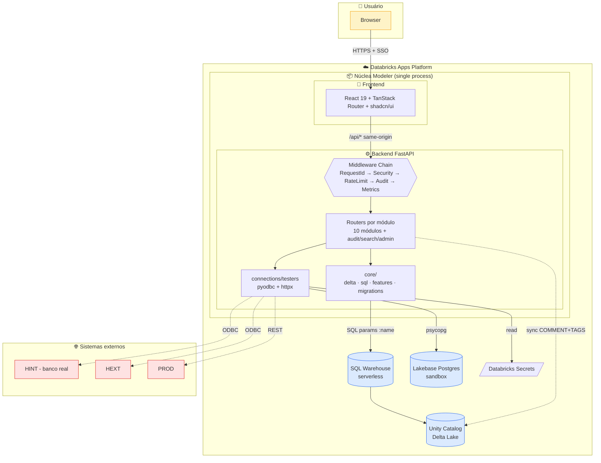
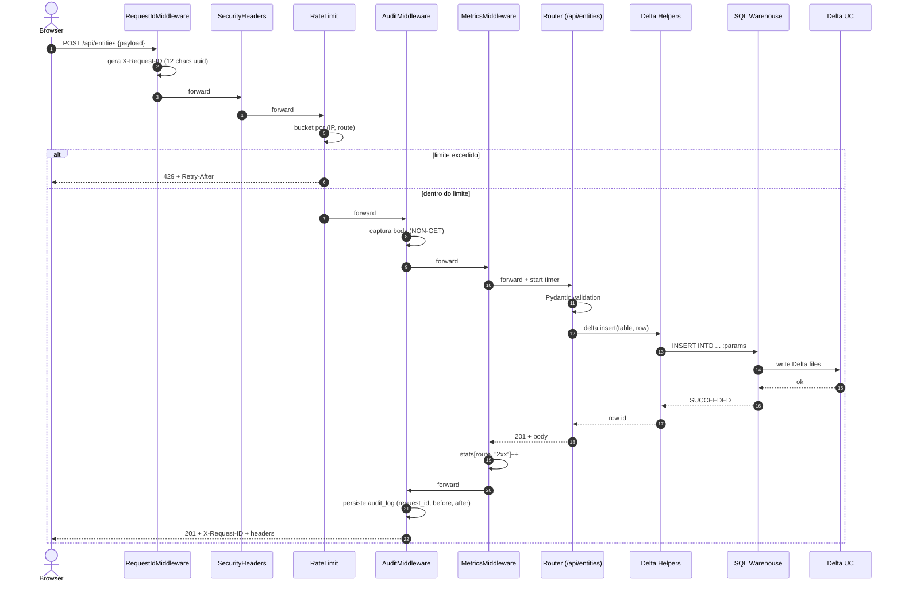
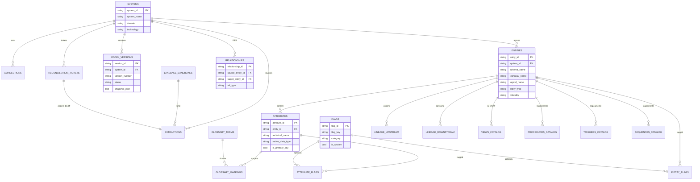
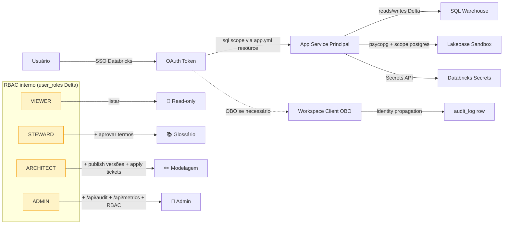
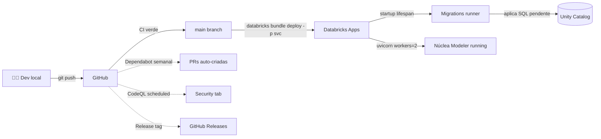

# Arquitetura — Núclea Modeler

Diagramas Mermaid renderizados nativamente pelo GitHub. Para edição visual:
copie o bloco no [Mermaid Live Editor](https://mermaid.live).

## 1. Visão de alto nível (componentes)

## 2. Request lifecycle

Como uma chamada `POST /api/entities` atravessa a stack:

## 3. Modelo Delta (resumo)

Tabelas principais do `data_catalog_app` schema (25 tabelas no total). Relações
lógicas — não há FK constraints reais no Delta, validação acontece no app.

## 4. Auth & permissões

## 5. Deploy

## Onde editar

- **Componentes de alto nível:** edite o bloco em **§1**.
- **Novo módulo:** adicione node + edge no §1, e seção no `docs/spec/`.
- **Nova tabela Delta:** atualize §3 + crie migration em `databricks/sql/`.
- **Novo papel RBAC:** §4 + `backend/rbac/service.py`.

Para preview offline: `mermaid-cli` (`bunx mmdc -i system.md -o out.png`).
